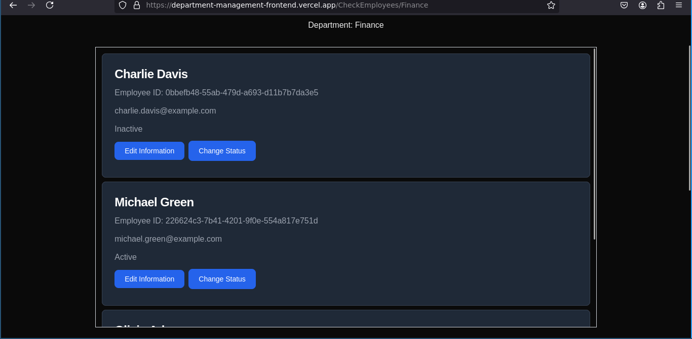

In this project I used Nextjs and tailwindcss for the front end and made API endpoints using flask from the back end with mongoDB for the database.

## Procedure on how to use the App
1. First Go to https://department-management-frontend.vercel.app/

 

 

2. If you click at "Check Employees" button you will be put to Employees and Add Employees section

 

 

3. In here you can fill up a form to add a new Employee

 

 

4. If done correctly a new employee will be added to the corresponding department's table

 

 

5. Then you can click the Sidebar and "Departments" to go back to the list of departments

 

 

6. Let's say you have a valid CSV file with the format department_name,name,email,status

 

 

7. you can go to "upload CSV files" in the sidebar where you can upload the CSV file

 

 

 

 

 

 

If everythin goes right the employees will be put to their corresponding departments.

 

